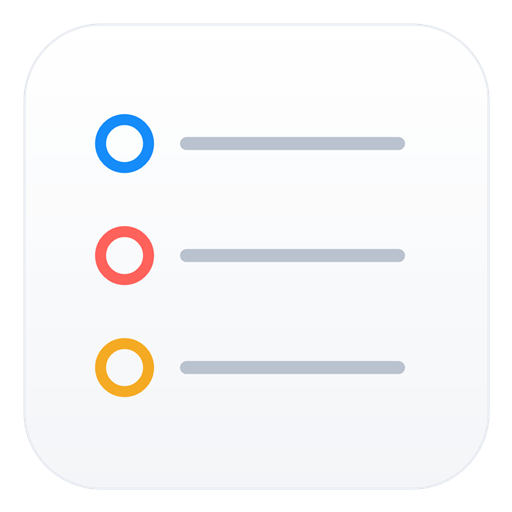

<div align="center">


# Reminders for Windows

**A native WinUI 3 client for iCloud Reminders, written in C#/.NET.**
</div>

Apple does not ship Reminders for Windows. This project provides an offline-capable
Windows client with background sync and due-date notifications. The UI and iCloud
engine run in one process. Rust, a separate sidecar, Node.js, and a browser runtime
are no longer required.

> This independent project is not authorized, sponsored, endorsed, or otherwise
> approved by Apple Inc. It uses private, undocumented iCloud interfaces that may
> change or stop working without notice. Read [LEGAL.md](LEGAL.md) before use.

## Develop in Visual Studio

Open **Reminders.Windows.sln** in Visual Studio 2022 or newer with .NET desktop
development and Windows Application Packaging Project tools installed. Select
**x64** or **ARM64** and set **Reminders.Package** as the startup project to debug
the MSIX application. Configure a local signing certificate in the packaging
project before deploying; no signing key is committed to this repository.

The solution contains the WinUI app, its C# backend library, the MSIX packaging
project, and account-free backend/updater tests. Existing SQLite caches and Windows
Credential Manager entries retain their formats and names.

## Quick start: demo mode

With the .NET 8 SDK or newer installed on Windows:

```powershell
.\scripts\run-windows.ps1 -Demo
```

Demo mode uses in-memory sample data, without opening the real cache or connecting
to iCloud. For a normal unpackaged development launch, omit `-Demo`.

## Build and package

```powershell
.\scripts\check-prereqs.ps1 -Msix
.\scripts\build-msix.ps1 -Architecture x64
.\scripts\build-msix.ps1 -Architecture ARM64
```

Packages are written to `dist-msix`. Windows requires a signed MSIX; use a
certificate whose publisher matches the package identity:

```powershell
.\scripts\build-msix.ps1 -Architecture x64 -CertificateThumbprint YOUR_THUMBPRINT
```

Visual Studio's **Create App Packages** command also builds the package from the
same checked-in manifest and assets. For Microsoft Store distribution, associate
the packaging project with the assigned Store identity. Package versions must
increase for upgrades. See [Getting started](docs/getting-started.md).

Portable builds remain available through `scripts/build-windows.ps1`; the optional
Inno Setup installer remains available through `scripts/build-installer.ps1` for
existing users. MSIX installations use Windows/Store package deployment for
upgrades. The app's GitHub updater executes installers only for Inno installations;
MSIX and portable builds show a release link.

## What works

| Feature | Support |
|---|---|
| Lists and reminders | Read lists; read and write reminders |
| Titles, notes, due dates, priorities, completion and flags | Read and write |
| Smart lists | Today, Upcoming, All, Completed and Deleted |
| Search and sorting | Local SQLite queries |
| Tags | Read and filter |
| Offline use | Cached reads; edits queue for upload |
| Automatic sync | Launch/return, after edits, and every 10 minutes by default |
| Authentication | Apple ID, SMS 2FA, terms acceptance and session restoration |
| Conflicts | Preserve local/remote versions for explicit resolution |
| Windows integration | Native controls, theme, badges and due notifications |

Creating or changing lists is unsupported: CloudKit Web Services list records do
not propagate to Apple devices. Two-factor sign-in requires a trusted phone number
and a texted code. Apple's HSA2 device-prompt bridge is not implemented. See
[protocol findings](docs/protocol-findings.md).

## Architecture

```text
Reminders.WinUI (C# / WinUI 3)
        | direct asynchronous calls and events
Reminders.Core (C# / .NET 8)
        +-- Apple SRP authentication and Windows Credential Manager
        +-- CloudKit records, text documents and sync/conflict handling
        +-- SQLite cache, durable outbox and notification planning
Reminders.Package (Visual Studio MSIX project)
```

Cache and account operations execute off the UI dispatcher. Local reads remain
available during network requests. Edits and outbox entries commit together;
upload acknowledgments preserve and rebase newer queued edits. Sync has bounded
responses, pagination and a ten-minute deadline. Due dates preserve Apple's
floating wall-clock representation and daylight-saving behavior.

Unpackaged data is under `%LOCALAPPDATA%\RemindersSync`; Windows may virtualize
LocalAppData for packaged installations. Passwords and session tokens remain in
Windows Credential Manager, never SQLite. Review logs before sharing. See
[the frontend notes](docs/native-windows-frontend.md).

## Tests

```powershell
dotnet run --project .\src-windows\Reminders.Core.Tests\Reminders.Core.Tests.csproj -c Release
dotnet run --project .\src-windows\AppUpdater.Tests\AppUpdater.Tests.csproj -c Release
dotnet build .\src-windows\Reminders.WinUI\Reminders.WinUI.csproj -c Release -p:Platform=x64
```

Tests are account-free and cover independent SRP vectors, credential chunk recovery,
Apple text documents, cache/outbox behavior, DST dates and mocked HTTP. Live iCloud
interoperability requires a disposable account; see [SECURITY_AUDIT.md](SECURITY_AUDIT.md).

## Credits

Maintained by Paul Savvas. Package publisher: [paulsavvas.com](https://paulsavvas.com).
Apple and iCloud are trademarks of Apple Inc., registered in the U.S. and other
countries and regions. Product names describe compatibility only.
